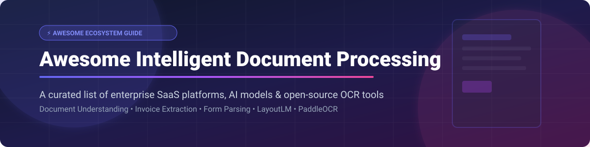

  

# 📄 Awesome Intelligent Document Processing (IDP) 🚀

  
  
  
  
  
  

> **A comprehensive curated list of top Intelligent Document Processing (IDP) SaaS platforms, computer vision OCR engines, multimodal AI foundation models, and open-source document understanding frameworks.**

---

## 📊 Market Overview & Intelligence 🧠

The global **Intelligent Document Processing (IDP)** market size was valued at approximately **\$1.8 Billion to \$2.3 Billion in 2023–2024** and is projected to reach over **\$10 Billion to \$14 Billion by 2030–2032**, expanding at a CAGR of **~30%–33%**. 

The sector is **moderately fragmented**: while legacy automation giants (such as ABBYY and Kofax) and AI-native category leaders (Rossum, Hyperscience, Nanonets) hold dominant enterprise market shares in high-volume document pipelines, rapid breakthroughs in Multimodal Large Language Models (MLLMs), layout-aware vision transformers, and open-source OCR toolkits allow specialized vertical solutions and open-source architectures to actively compete.

---

## 📚 Table of Contents 📌

- [📊 Market Overview & Intelligence](#-market-overview--intelligence-)
- [🏢 SaaS & Hosted IDP Platforms](#-saas--hosted-idp-platforms)
- [🔓 Open-Source GitHub Projects](#-open-source-github-projects)
- [🛠️ How to Contribute](#️-how-to-contribute)
- [💖 Support & Sponsorship](#-support--sponsorship)
- [📈 Star History](#-star-history)
- [⚠️ Disclaimer](#️-disclaimer)

---

## 🏢 SaaS & Hosted IDP Platforms 💼

| Company / Product | Starting Tier Pricing 💰 | Free Tier / Trial Limit ⏳ | Valuation / Revenue 📈 | Description 📝 |
| :--- | :--- | :--- | :--- | :--- |
| **[Kofax TotalAgility](https://www.kofax.com/)** | \$2,500 / month starting base enterprise license | 14-day enterprise trial available on request | **\$3.0B valuation** (Acquired by Clearlake & TaAssociates for ~\$3B; revenue \$500M+) | Enterprise intelligent automation platform combining capture, IDP, and process orchestration for massive document workloads. |
| **[ABBYY Vantage](https://www.abbyy.com/)** | \$500 / month (or ~\$19,900/yr base tier for 100k pages) | 30-day free trial with 500 document processing credits | **\$1.0B+ valuation** (Revenue ~\$300M+) | Established IDP suite featuring pre-trained AI document skills, advanced OCR, and enterprise capture capabilities. |
| **[Hyperscience](https://www.hyperscience.com/)** | \$1,500 / month minimum commitment (annual contract basis) | 14-day hosted demo/sandbox environment | **\$810M valuation** (Series E funding; revenue ~\$80M+) | Enterprise IDP platform recognized for ultra-high automation rates, human-in-the-loop verification, and complex document processing. |
| **[Nanonets](https://nanonets.com/)** | \$499 / month (includes 5,000 pages, then \$0.10/page) | Free tier: 500 pages total free forever | **\$500M valuation** (Raised \$29M Series B in 2024; revenue ~\$30M+) | Cloud IDP & OCR platform offering automated extraction, workflow triggers, and continuous learning for invoices and receipts. |
| **[Ocrolus](https://www.ocrolus.com/)** | \$1,000 / month base subscription + usage tier | 14-day sandbox access with 100 document upload credits | **\$500M valuation** (Series C funding; revenue ~\$40M+) | Document AI platform specialized in financial documents (bank statements, paystubs, tax forms) with hybrid human verification. |
| **[Rossum](https://rossum.ai/)** | \$1,500 / month starting subscription tier | 14-day free trial with 300 page extractions | **\$275M valuation** (Series A \$100M round led by General Catalyst) | AI-native transactional document processing platform focused on zero-template setup and transactional accuracy. |
| **[Indico Data](https://indicodata.ai/)** | \$2,000 / month estimated enterprise entry tier | 14-day custom trial demo upon consultation | **\$200M valuation** (Total funding \$50M+; revenue ~\$15M+) | Unstructured document intelligence platform built for complex, variable enterprise workflows and custom intake. |
| **[Docsumo](https://www.docsumo.com/)** | \$500 / month (Growth plan starting tier) | 14-day free trial with 100 document credits | **\$50M valuation** (Pre-Series A funded; revenue ~\$5M+) | Document AI platform designed for automated data extraction from invoices, financial statements, and identity documents. |
| **[Infrrd](https://www.infrrd.ai/)** | \$1,200 / month base commercial tier | 14-day demo trial upon enterprise request | **\$40M valuation** (Bootstrapped/Private funding; revenue ~\$12M+) | Enterprise AI platform specializing in no-touch data extraction and document classification for complex unstructured layouts. |
| **[Ephesoft](https://ephesoft.com/)** | \$800 / month base server licensing | 30-day trial license available for on-prem/cloud | **\$35M valuation** (Acquired by Kofax / Tungsten Automation) | Intelligent document capture and classification solution for separating multi-page document batches and extracting structured data. |

---

## 🔓 Open-Source GitHub Projects 🐙

Below is a curated list of top open-source repositories for OCR, document layout analysis, text detection, and IDP pipelines, sorted by GitHub star count.

- **[Tesseract OCR](https://github.com/tesseract-ocr/tesseract)**   
  Classic, highly popular open-source OCR engine supporting over 100 languages, widely used as a baseline for document text extraction pipelines.

- **[PaddleOCR](https://github.com/PaddlePaddle/PaddleOCR)**   
  Awesome multi-language OCR toolkit based on PaddlePaddle, supporting ultra-lightweight OCR models, layout analysis, table recognition, and document structure recovery.

- **[Unstructured](https://github.com/Unstructured-IO/unstructured)**   
  Open-source ingest and processing library for converting PDF, HTML, DOCX, and image documents into structured text optimized for LLMs and RAG architectures.

- **[EasyOCR](https://github.com/JaidedAI/EasyOCR)**   
  Ready-to-use Python OCR library powered by PyTorch, supporting 80+ languages and script identification out of the box.

- **[UniLM / LayoutLM](https://github.com/microsoft/unilm)**   
  Microsoft's open-source multimodal pre-trained foundation models (LayoutLM, LayoutLMv2, LayoutLMv3, LayoutXLM) for document image understanding and key-value extraction.

- **[Label Studio](https://github.com/HumanSignal/label-studio)**   
  Multi-type open-source data labeling tool for bounding box annotations, text classification, and preparing custom document training datasets.

- **[PDFMathTranslate](https://github.com/ByT5/PDFMathTranslate)**   
  PDF document translation tool that preserves original complex layouts, mathematical formulas, and formatting seamlessly.

- **[docTR (Document Text Recognition)](https://github.com/mindee/doctr)**   
  Seamless PyTorch & TensorFlow deep learning library for end-to-end document OCR, text detection, and page structure parsing.

- **[Marker](https://github.com/VikParuchuri/marker)**   
  Fast, accurate open-source pipeline to convert PDF documents into clean Markdown, formatting equations, code blocks, and tables for LLM consumption.

- **[Nougat](https://github.com/facebookresearch/nougat)**   
  Meta AI's Neural Optical Understanding for Academic Documents, an OCR-free visual transformer model for converting scientific PDFs into LaTeX/Markdown.

- **[Surya](https://github.com/VikParuchuri/surya)**   
  Multilingual OCR, layout analysis, document line detection, and reading order extraction model with high accuracy across languages.

- **[MMOCR](https://github.com/open-mmlab/mmocr)**   
  OpenMMLab toolbox providing modular PyTorch implementations of state-of-the-art text detection, text recognition, and key information extraction algorithms.

- **[Donut](https://github.com/clovaai/donut)**   
  Naver Clova's OCR-free document understanding transformer model that directly maps document images to structured JSON output without off-the-shelf OCR engines.

- **[PDFBox](https://github.com/apache/pdfbox)**   
  Apache's open-source Java library for creating, converting, and extracting text and metadata content from PDF documents.

- **[pdfplumber](https://github.com/jsvine/pdfplumber)**   
  Plumb a PDF for detailed information about each text character, rectangle, and line—plus spatial layout and robust table extraction in Python.

---

### 💡 Building Custom IDP Pipelines with Open Source ⚙️

1. **Ingestion & Preprocessing**: Clean noise and adjust orientation with OpenCV/Scikit-Image.
2. **Text Detection & Recognition**: Use **docTR**, **PaddleOCR**, or **Surya** for high-accuracy multilingual OCR.
3. **Layout & Key-Value Extraction**: Leverage **LayoutLMv3**, **Donut**, or **Marker** to convert documents into structured JSON or Markdown.
4. **LLM/RAG Integration**: Feed structured chunks into vector databases using **Unstructured** for downstream question answering and automated enterprise workflows.

---

## 🛠️ How to Contribute 🤝

Contributions are very welcome! To add or update an entry:

1. Fork the repository.
2. Update `README.md` following the table/list guidelines.
3. Ensure factual information and link directly to official project/company sites.
4. Submit a Pull Request with a short description of changes.

---

## 💖 Support & Sponsorship ☕

If you find this repository valuable for your research, enterprise architecture, or development workflows, please consider supporting the project:

- ⭐ **Star this repository** to help others discover it!
- 🔀 **Fork it** to add your own tools and contribute back.
- 📢 **Share** with your colleagues, engineering teams, and document processing communities.
- ☕ **Buy me a coffee / Sponsor**: If you'd like to support ongoing open-source curation and maintenance, visit the [GitHub Sponsor Dashboard](https://github.com/sponsors/ishandutta2007). Thank you for your support!

---

## 📈 Star History

---

## ⚠️ Disclaimer 📜

- This is a community-curated collection intended strictly for informational and educational purposes.
- Document processing frequently touches confidential, financial, and personal identifiable data (PII). Ensure proper security controls, compliance standards (GDPR, HIPAA, SOC2), and accuracy evaluations before deploying any IDP system.
- Trade names and registered trademarks are the property of their respective owners.

---

  <b>Maintained with ❤️ for automation engineers, ML practitioners, and operations leaders.</b>

